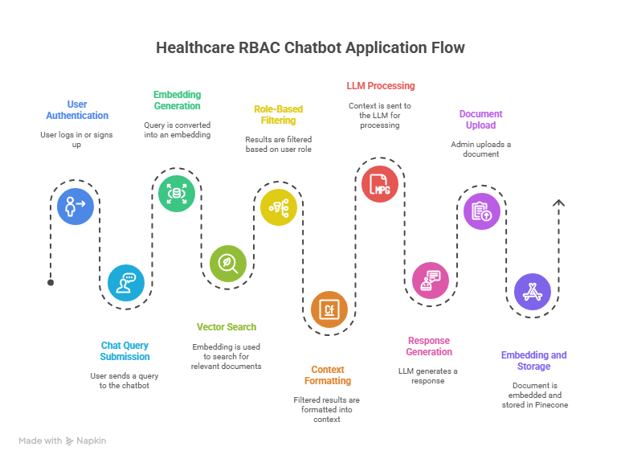

# 🏥 RBAC-based RAG Medical Chatbot

A secure, role-based access control (RBAC) chatbot designed for healthcare platforms, powered by Retrieval-Augmented Generation (RAG) with FastAPI, MongoDB, Pinecone, and LangChain.


## 🧠 Overview

This project is a secure, role-sensitive chatbot that answers medical queries using LLMs and vector-based document retrieval. It supports role-based access for **Doctors**, **Nurses**, **Patients**, and **Admins**, ensuring that sensitive medical information is retrieved and displayed based on user privileges.

---




[📄 View Full Project Report (PDF)](./assets/projectReport.pdf)

---

## Deployed URL :

![Frontend] https://rbac-medicalassistant-vbs9bxxzjfnpab6dsrfwah.streamlit.app/
![Backend] https://rbac-medicalassistant.onrender.com

## ⚙️ Tech Stack

- **Backend:** FastAPI (modular)
- **Database:** MongoDB Atlas (for users)
- **Vector DB:** Pinecone (RAG context)
- **LLM:** Groq API using LLaMA-3
- **Embeddings:** Google Generative AI Embeddings
- **Authentication:** HTTP Basic Auth + bcrypt
- **Frontend (Optional):** Streamlit

---

## 🧩 Core Modules

| Module      | Responsibility                                              |
| ----------- | ----------------------------------------------------------- |
| `auth/`     | Handles authentication (signup, login), hashing with bcrypt |
| `chat/`     | Manages chat routes and query answering logic using RAG     |
| `vectordb/` | Document loading, chunking, and Pinecone indexing           |
| `database/` | MongoDB setup and user operations                           |
| `main.py`   | Entry point for FastAPI app with route inclusion            |

---

## 🔐 Role-Based Access Flow

- **Admin:** Uploads documents and assigns roles.
- **Doctor/Nurse:** Retrieves clinical documents specific to their role.
- **Patient:** Can query general medical info (restricted access).
- **Other/Guest:** Limited access to public health content.

---

## 📡 API Endpoints

| Method | Route          | Description                         |
| ------ | -------------- | ----------------------------------- |
| POST   | `/signup`      | Register new users                  |
| GET    | `/login`       | Login with HTTP Basic Auth          |
| POST   | `/upload_docs` | Admin-only endpoint to upload files |
| POST   | `/chat`        | Role-sensitive chatbot Q\&A         |

---

## 🚀 Getting Started

1. Clone the repo:

   ```bash
   git clone https://github.com/yourusername/rbac-medicalAssistant.git
   cd rbac-medicalAssistant
   ```

2. Create a `.env` file:

   ```env
   MONGO_URI=your_mongo_uri
   DB_NAME=your_db_name
   PINECONE_API_KEY=your_pinecone_key
   GOOGLE_API_KEY=your_google_api_key
   GROQ_API_KEY=your_groq_key
   ```

3. Create venv:

   ```bash
   uv venv
   .venv/Scripts/activate
   ```

4. Install dependencies:

   ```bash
   uv pip install -r requirements.txt
   ```

5. Run the app:

   ```bash
   uvicorn main:app --reload
   ```

---

## 🌱 Future Enhancements

- Add JWT-based Auth + Refresh Tokens
- Build an interactive Streamlit/React-based frontend
- Document download/preview functionality
- Audit logs for medical compliance
- Many more
- **🧍️‍ Contributions are welcome! Feel free to fork and submit PRs.**

---

© 2025 \[Supratim / sn dev] — All rights reserved.
